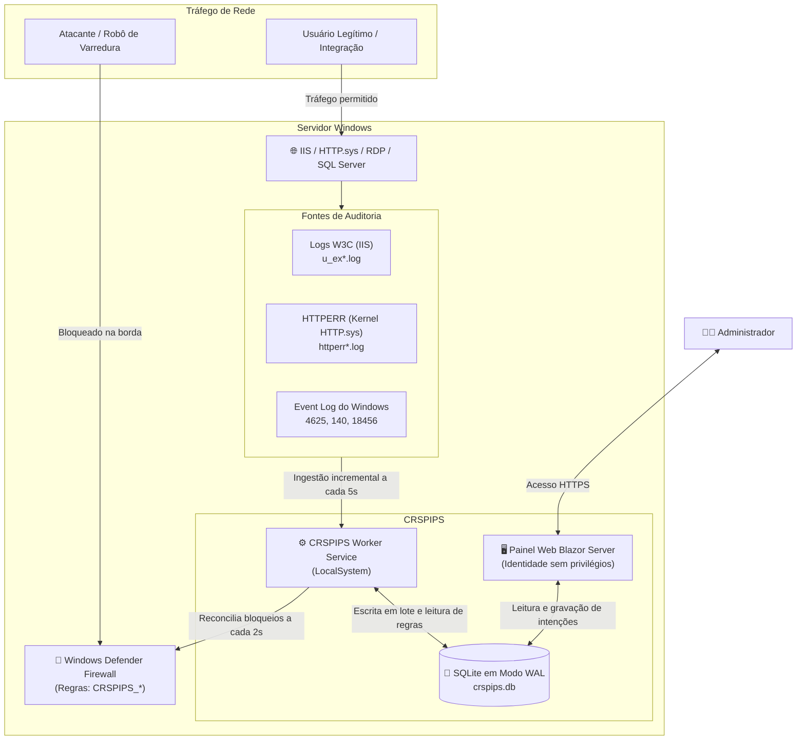

O **CRSPIPS** é um **Sistema de Prevenção de Intrusões Baseado em Host (HIPS)** de alta performance desenvolvido especialmente para **Windows Server**, projetado para proteger servidores web **IIS (Internet Information Services)**, conexões **RDP (Área de Trabalho Remota)** e instâncias do **Microsoft SQL Server**.

O sistema atua de ponta a ponta: analisa logs de requisições e eventos do Windows em tempo real, correlaciona ataques via regras de detecção inteligentes e bloqueia invasores diretamente no **Windows Defender Firewall** através de chamadas nativas de baixo nível.

---

## 🗺️ Mapa de Navegação da Wiki

Utilize o índice abaixo para navegar pelos tópicos detalhados:

| Página | Descrição do Conteúdo |
|---|---|
| [🚀 Instalação e Configuração](01-Instalacao-e-Configuracao) | Requisitos de sistema, instalação do .NET 10 Hosting Bundle, criação do site, pool do IIS, permissões e criação do Windows Service. |
| [⚙️ Motor e Regras de Detecção](02-Motor-e-Regras) | Catálogo das 16 regras nativas, regex com tempo linear, URLs ignoradas, janelas deslizantes e cálculo de punição progressiva. |
| [🧱 Firewall e Gestão de Listas](03-Firewall-e-Listas) | Integração COM do Windows Defender Firewall, agrupamento de 1.000 IPs por regra, listas brancas/negras, Threat Intelligence pública e política de países (GeoIP). |
| [📊 APM e Métricas do IIS](04-APM-e-Metricas-IIS) | Observabilidade de rotas web, normalização inteligente de URLs (`{id}`), monitoramento de CPU/Memória dos pools (`w3wp.exe`) e exportação CSV. |
| [🛠️ Operação e Solução de Problemas](05-Operacao-e-Troubleshooting) | Comandos de manutenção, procedimentos de atualização, recuperação de emergência (auto-bloqueio) e matriz de diagnóstico. |

---

## 🏗️ Visão Geral da Arquitetura

O sistema opera sob o **Princípio do Menor Privilégio**, garantindo isolamento total entre a interface web e o motor de segurança:

---

## ⚡ Principais Recursos do Produto

* **Bloqueio Nativo no Firewall:** Não depende de scripts lentos em PowerShell; opera diretamente via API COM (`HNetCfg.FwPolicy2`) agrupando até 1.000 IPs por regra para preservar a velocidade da rede.
* **Tolerância Zero para Invasores:** Proteção imediata contra injeção de SQL, path traversal, Log4Shell, varreduras de arquivos `.env`/`.git`/credenciais, força bruta no RDP e scanners de PHP/JSP.
* **Punição Progressiva:** Escalonamento punitivo automático para reincidentes (ex.: 1 hora $\to$ 24 horas $\to$ 7 dias $\to$ 30 dias).
* **Threat Intelligence Integrada:** Suporte a feeds de inteligência de ameaças mundiais (Spamhaus DROP, SANS DShield, IPsum, CINS Army, blocklist.de) com modos inovadores (Avaliação, Reativo e Ativo).
* **Política de Países (GeoIP MaxMind):** Isole portas críticas (como RDP na porta 3389) permitindo acesso exclusivo de endereços de países específicos (ex: Brasil).
* **Modo Simulação Seguro:** Permite testar o sistema em homologação registrando tudo o que seria bloqueado, com zero risco de interrupção operacional.
* **APM Leve do IIS:** Identifica rotas mais lentas, taxas de erro 4xx/5xx e monitora consumo de memória e CPU dos processos de trabalho `w3wp.exe`.

---

## 🔒 Segurança por Design

1. **O Painel Web Nunca Toca no Firewall:** O site roda como usuário restrito do IIS. Ele apenas grava configurações no banco. Somente o serviço de background (`Worker`), rodando como `LocalSystem`, altera regras de rede.
2. **Proteção Permanente contra Auto-Bloqueio:** Redes locais privadas, IPs das placas de rede do servidor e os IPs dos administradores logados nos últimos 7 dias são protegidos de forma irrestrita.
3. **Criptografia DPAPI:** Chaves de licença MaxMind e tokens de autenticação são cifrados na camada do sistema operacional Windows via DPAPI.
4. **Proteção contra Injeção:** Expressões regulares rodam sob `RegexOptions.NonBacktracking` (blindagem contra ReDoS) e exportações tabulares contam com sanitização contra *CSV Formula Injection*.
